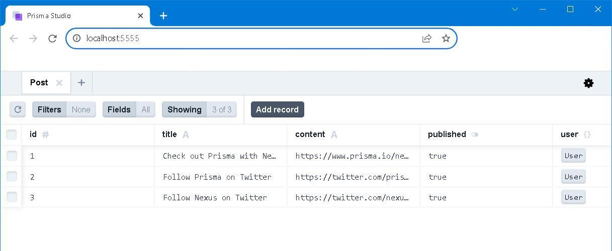

## [Primsa](https://www.prisma.io/) x [Planetscale](https://planetscale.com/) ── A starter guide 


### Prologue 
Changing one's viewpoint is easy; changing one's mindset is difficult but not *impossible*. People are largely divided into either *liberal* or *conservative* in terms of ideology. Whether believing in ghost or UFO has nothing to do with one's education backgrounds and so does one's political tendency. 

[Do I need an ORM](https://www.prisma.io/dataguide/types/relational/what-is-an-orm) in the first place? [Why Prisma?](https://www.prisma.io/docs/concepts/overview/why-prisma) and [How Prisma and PlanetScale fit together](https://www.prisma.io/planetscale).

> In general, an ORM might be a good fit if you are using many object-oriented features of your language to manage a lot of state. The implications of managing state encapsulated in objects that have complex inheritance relationships, for instance, may be difficult to account for manually. They can also help get your project off the ground easier and can manage changes in your data structure through functionality like schema migration.

> While ORMs are often useful, they're not perfect. Sometimes the level of abstraction introduced by an ORM can make debugging difficult. There are also times when the representation the ORM uses to translate between the database and your application might not be completely accurate or might leak details of your internal implementation. These may be problems for certain use cases.

> Prisma makes it easy for developers to reason about their database queries by providing a clean and type-safe API for submitting database queries which returns plain old JavaScript objects.


- Raw SQL: Full control, low productivity
- SQL query builders: High control, medium productivity
- ORMs: Less control, better productivity

```
npx prisma --help
Prisma is a modern DB toolkit to query, migrate and model your database (https://prisma.io)

Usage
  $ prisma [command]

Commands
        init  Set up Prisma for your app
    generate  Generate artifacts (e.g. Prisma Client)
          db  Manage your database schema and lifecycle
      migrate Migrate your database
      studio  Browse your data with Prisma Studio
    validate  Validate your Prisma schema
      format  Format your Prisma schema
```


### I. Initialize project 
```
npm -y 

npm install prisma --save-dev

npx prisma init --datasource-provider mysql 
```

.env
```
DATABASE_URL="mysql://<username>:<password>@<host>:<port>/<dbname>"

SHADOW_DATABASE_URL='mysql://<username>:<password>@<host>/<dbname>'
```


### II. Prepare the schema
prisma/schema.prisma
```
generator client {
  provider = "prisma-client-js"
}

datasource db {
  provider          = "mysql"
  url               = env("DATABASE_URL")
  shadowDatabaseUrl = env("SHADOW_DATABASE_URL")
  relationMode      = "prisma"
}

model User {
  id    Int    @id @default(autoincrement())
  email String @unique
  name  String
  posts Post[]

  createdAt DateTime  @default(now())
  updatedAt DateTime? @updatedAt

  @@map("users")
}

model Post {
  id        Int     @id @default(autoincrement())
  title     String
  content   String
  published Boolean @default(false)
  user      User    @relation(fields: [userId], references: [id])
  userId    Int

  createdAt DateTime  @default(now())
  updatedAt DateTime? @updatedAt

  @@index([userId])
  @@map("posts")
}
```


### III. Create database tables 
```
npx prisma migrate dev --name initial load
```


### IV. Seeding the data
prisma/seed.js
```
import { PrismaClient } from '@prisma/client'
const prisma = new PrismaClient()
async function main() {
  const alice = await prisma.user.upsert({
    where: { email: 'alice@prisma.io' },
    update: {},
    create: {
      email: 'alice@prisma.io',
      name: 'Alice',
      posts: {
        create: {
          title: 'Check out Prisma with Next.js',
          content: 'https://www.prisma.io/nextjs',
          published: true,
        },
      },
    },
  })
  const bob = await prisma.user.upsert({
    where: { email: 'bob@prisma.io' },
    update: {},
    create: {
      email: 'bob@prisma.io',
      name: 'Bob',
      posts: {
        create: [
          {
            title: 'Follow Prisma on Twitter',
            content: 'https://twitter.com/prisma',
            published: true,
          },
          {
            title: 'Follow Nexus on Twitter',
            content: 'https://twitter.com/nexusgql',
            published: true,
          },
        ],
      },
    },
  })
  console.log({ alice, bob })
}
main()
  .then(async () => {
    await prisma.$disconnect()
  })
  .catch(async (e) => {
    console.error(e)
    await prisma.$disconnect()
    process.exit(1)
  })
```

```
npx prisma db seed 
```


### V. Browse the data
```
npx prisma studio
```



### VI. Summary 
Repeating modifying schema and migrating would cause various [migration errors](https://www.prisma.io/docs/guides/migrate/production-troubleshooting#failed-migration). I just can't figure out why and how to fix it. The easiest way is to completely remove the **migrations** folder and re-migrate, re-seed the tables again. Due to the limitation on  my Planetscale free plan, I need to provide a shadow database url. This is where my [laragon](https://laragon.org/index.html) comes into play. 


### VII. Reference
1. [Prisma Course: Zero To Hero](https://youtu.be/yW6HnMUAWNU)
2. [Prisma | Quickstart](https://www.prisma.io/docs/getting-started/quickstart)
3. [Prisma | MySQL](https://www.prisma.io/docs/concepts/database-connectors/mysql)
4. [Prisma | Schema](https://www.prisma.io/docs/concepts/components/prisma-schema)
5. [Prisma | Relation mode](https://www.prisma.io/docs/concepts/components/prisma-schema/relations/relation-mode)
6. [Prisma | About the shadow database](https://www.prisma.io/docs/concepts/components/prisma-migrate/shadow-database)
7. [Prisma | Seeding your database](https://www.prisma.io/docs/guides/migrate/seed-database)
8. [A cheat sheet repository of prisma ORM - GitHub]()
9. [Planetscale | quickstart guide](https://planetscale.com/docs/tutorials/planetscale-quick-start-guide)
10. [Planetscale | Operating without foreign key constraints](https://planetscale.com/docs/learn/operating-without-foreign-key-constraints)
11. [Planetscale | Pricing](https://planetscale.com/pricing)
12. [The Sphinx](https://poemuseum.org/the-sphinx/)


### Epilogue
> ... upon the idea that a principle source of error in all human investigations, lay in the liability of the understanding to under-rate or to over-value the importance of an object, through mere mis-admeasurement of its propinquity.


### EOF (2023/08/28)